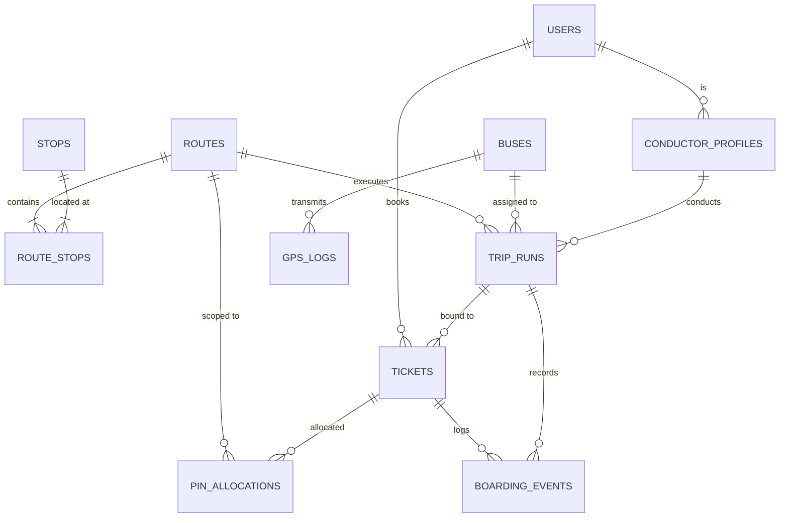
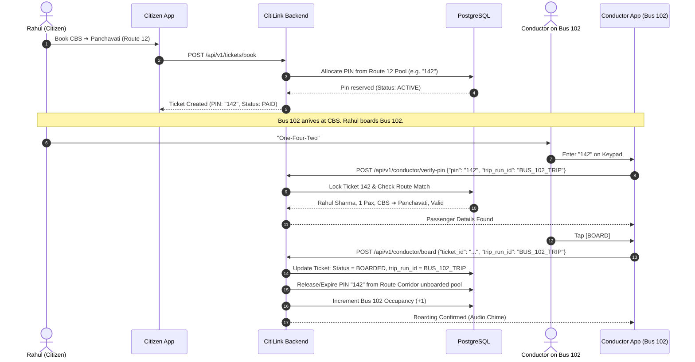

# CitiLink — Technical Architecture & System Design Document

| Document Version | 1.0.0 |
| :--- | :--- |
| **System** | CitiLink Transit & Digital Ticketing Platform |
| **Architecture Style** | Event-Driven Micro-Modular Monolith (FastAPI) + Offline-First Mobile Clients |
| **Target Scale** | 200+ Active Buses, 50,000+ Daily Passengers, < 100ms Validation Latency |

---

# 1. System Topology & Component Overview

```text
                                       ┌────────────────────────────────┐
                                       │      CITIZEN MOBILE APP        │
                                       │   (Android / Jetpack Compose)  │
                                       └───────────────┬────────────────┘
                                                       │ HTTPS / WSS
                                                       ▼
┌────────────────────────────────┐     ┌────────────────────────────────┐
│      CONDUCTOR MOBILE APP      │     │       API GATEWAY / FASTAPI    │
│  (Android / Offline Room DB)   ├────►│  • Route & Ticket Endpoints    │
└────────────────┬───────────────┘     │  • PIN Allocation Subsystem    │
                 │ Sync POST           │  • GPS Ingestion & Geofencing  │
                 ▼                     │  • Occupancy Realtime Engine   │
┌────────────────────────────────┐     └───────┬──────────────┬─────────┘
│      BUS GPS IOT DEVICE /      │             │              │
│       DRIVER APP TELEMETRY     ├─────────────┘              │
└────────────────────────────────┘                            │
                                                              ▼
                                               ┌────────────────────────────────┐
                                               │     POSTGRESQL 16 + POSTGIS    │
                                               │  • Users, Routes, Stops        │
                                               │  • Trip Runs, Tickets, PINs    │
                                               │  • Boarding Events, Telemetry  │
                                               └──────────────┬─────────────────┘
                                                              │
                                                              ▼
                                               ┌────────────────────────────────┐
                                               │     ADMIN WEB DASHBOARD        │
                                               │   (React / Vite / Tailwind)    │
                                               └────────────────────────────────┘
```

---

# 2. Database Schema Design (PostgreSQL 16 + PostGIS)



### PostgreSQL DDL Specification

```sql
-- 1. ENUMS & EXTENSIONS
CREATE EXTENSION IF NOT EXISTS "uuid-ossp";
CREATE EXTENSION IF NOT EXISTS "postgis";

CREATE TYPE user_role_enum AS ENUM ('CITIZEN', 'CONDUCTOR', 'DEPOT_ADMIN', 'SUPER_ADMIN');
CREATE TYPE passenger_type_enum AS ENUM ('STANDARD', 'SENIOR');
CREATE TYPE trip_status_enum AS ENUM ('SCHEDULED', 'ACTIVE', 'PAUSED', 'COMPLETED', 'CANCELLED');
CREATE TYPE ticket_type_enum AS ENUM ('DIGITAL', 'CASH');
CREATE TYPE payment_status_enum AS ENUM ('PENDING', 'PAID', 'REFUNDED', 'FAILED');
CREATE TYPE ticket_status_enum AS ENUM ('BOOKED', 'PAID', 'BOARDED', 'COMPLETED', 'CANCELLED', 'EXPIRED', 'NO_SHOW');
CREATE TYPE pin_status_enum AS ENUM ('RESERVED', 'ACTIVE', 'RELEASED');
CREATE TYPE boarding_method_enum AS ENUM ('TRAVEL_PIN', 'QR_SCAN', 'PHONE_LOOKUP', 'CASH_ENTRY');

-- 2. USERS & PROFILES
CREATE TABLE users (
    id UUID PRIMARY KEY DEFAULT uuid_generate_v4(),
    phone VARCHAR(15) UNIQUE NOT NULL,
    full_name VARCHAR(100) NOT NULL,
    role user_role_enum DEFAULT 'CITIZEN' NOT NULL,
    is_active BOOLEAN DEFAULT TRUE NOT NULL,
    created_at TIMESTAMPTZ DEFAULT NOW() NOT NULL,
    updated_at TIMESTAMPTZ DEFAULT NOW() NOT NULL
);

CREATE TABLE conductor_profiles (
    id UUID PRIMARY KEY DEFAULT uuid_generate_v4(),
    user_id UUID UNIQUE REFERENCES users(id) ON DELETE CASCADE,
    employee_id VARCHAR(50) UNIQUE NOT NULL,
    depot_name VARCHAR(100) NOT NULL,
    pin_hash VARCHAR(255) NOT NULL,
    is_active BOOLEAN DEFAULT TRUE NOT NULL,
    created_at TIMESTAMPTZ DEFAULT NOW() NOT NULL
);

-- 3. TRANSIT GEOMETRY & ROUTES
CREATE TABLE stops (
    id UUID PRIMARY KEY DEFAULT uuid_generate_v4(),
    name VARCHAR(100) NOT NULL,
    name_local VARCHAR(100), -- e.g. Marathi / Hindi script
    code VARCHAR(20) UNIQUE NOT NULL,
    location GEOMETRY(Point, 4326) NOT NULL,
    geofence_radius_meters INT DEFAULT 35 NOT NULL,
    is_active BOOLEAN DEFAULT TRUE NOT NULL,
    created_at TIMESTAMPTZ DEFAULT NOW() NOT NULL
);

CREATE TABLE routes (
    id UUID PRIMARY KEY DEFAULT uuid_generate_v4(),
    route_number VARCHAR(20) NOT NULL, -- e.g. "Route 12"
    name VARCHAR(150) NOT NULL,        -- e.g. "CBS to Panchavati via Ashok Stambh"
    direction VARCHAR(50) NOT NULL,   -- e.g. "UP", "DOWN"
    polyline GEOMETRY(LineString, 4326),
    base_fare DECIMAL(10,2) DEFAULT 10.00 NOT NULL,
    fare_per_km DECIMAL(10,2) DEFAULT 2.50 NOT NULL,
    is_active BOOLEAN DEFAULT TRUE NOT NULL,
    created_at TIMESTAMPTZ DEFAULT NOW() NOT NULL,
    CONSTRAINT uq_route_number_direction UNIQUE (route_number, direction)
);

CREATE TABLE route_stops (
    id UUID PRIMARY KEY DEFAULT uuid_generate_v4(),
    route_id UUID REFERENCES routes(id) ON DELETE CASCADE,
    stop_id UUID REFERENCES stops(id) ON DELETE RESTRICT,
    stop_sequence INT NOT NULL,
    distance_from_start_km DECIMAL(6,2) DEFAULT 0.00 NOT NULL,
    stage_number INT NOT NULL,
    fare_from_origin DECIMAL(10,2) NOT NULL,
    CONSTRAINT uq_route_sequence UNIQUE (route_id, stop_sequence),
    CONSTRAINT uq_route_stop UNIQUE (route_id, stop_id)
);

-- 4. FLEET & TRIP EXECUTION
CREATE TABLE buses (
    id UUID PRIMARY KEY DEFAULT uuid_generate_v4(),
    registration_number VARCHAR(20) UNIQUE NOT NULL, -- e.g. "MH-15-AB-1234"
    bus_number VARCHAR(20) NOT NULL,                 -- e.g. "101"
    model VARCHAR(50),
    seated_capacity INT DEFAULT 40 NOT NULL,
    standing_capacity INT DEFAULT 20 NOT NULL,
    total_capacity INT GENERATED ALWAYS AS (seated_capacity + standing_capacity) STORED,
    gps_device_imei VARCHAR(50) UNIQUE,
    is_active BOOLEAN DEFAULT TRUE NOT NULL,
    created_at TIMESTAMPTZ DEFAULT NOW() NOT NULL
);

CREATE TABLE trip_runs (
    id UUID PRIMARY KEY DEFAULT uuid_generate_v4(),
    route_id UUID REFERENCES routes(id) ON DELETE RESTRICT,
    bus_id UUID REFERENCES buses(id) ON DELETE RESTRICT,
    conductor_id UUID REFERENCES conductor_profiles(id) ON DELETE RESTRICT,
    status trip_status_enum DEFAULT 'SCHEDULED' NOT NULL,
    current_stop_sequence INT DEFAULT 1 NOT NULL,
    current_occupancy INT DEFAULT 0 NOT NULL,
    started_at TIMESTAMPTZ,
    ended_at TIMESTAMPTZ,
    created_at TIMESTAMPTZ DEFAULT NOW() NOT NULL
);

-- 5. TICKETS & ROUTE CORRIDOR TRAVEL PIN ALLOCATIONS
CREATE TABLE tickets (
    id UUID PRIMARY KEY DEFAULT uuid_generate_v4(),
    ticket_number VARCHAR(30) UNIQUE NOT NULL,
    user_id UUID REFERENCES users(id) ON DELETE SET NULL, -- Nullable for Cash Tickets
    route_id UUID REFERENCES routes(id) ON DELETE RESTRICT,
    trip_run_id UUID REFERENCES trip_runs(id) ON DELETE SET NULL, -- Bound on Boarding!
    from_stop_id UUID REFERENCES stops(id) ON DELETE RESTRICT,
    to_stop_id UUID REFERENCES stops(id) ON DELETE RESTRICT,
    from_stop_sequence INT NOT NULL,
    to_stop_sequence INT NOT NULL,
    passenger_count INT DEFAULT 1 NOT NULL,
    passenger_type passenger_type_enum DEFAULT 'STANDARD' NOT NULL,
    ticket_type ticket_type_enum DEFAULT 'DIGITAL' NOT NULL,
    fare_amount DECIMAL(10,2) NOT NULL,
    payment_status payment_status_enum DEFAULT 'PENDING' NOT NULL,
    payment_transaction_id VARCHAR(100),
    ticket_status ticket_status_enum DEFAULT 'BOOKED' NOT NULL,
    travel_pin VARCHAR(4), -- 2 digits (Senior) or 3 digits (Standard)
    qr_code_hash VARCHAR(255) UNIQUE,
    booked_at TIMESTAMPTZ DEFAULT NOW() NOT NULL,
    expires_at TIMESTAMPTZ NOT NULL,
    boarded_at TIMESTAMPTZ,
    completed_at TIMESTAMPTZ
);

CREATE TABLE pin_allocations (
    id UUID PRIMARY KEY DEFAULT uuid_generate_v4(),
    route_id UUID REFERENCES routes(id) ON DELETE CASCADE,
    ticket_id UUID UNIQUE REFERENCES tickets(id) ON DELETE CASCADE,
    pin_code VARCHAR(4) NOT NULL,
    passenger_type passenger_type_enum NOT NULL,
    status pin_status_enum DEFAULT 'ACTIVE' NOT NULL,
    allocated_at TIMESTAMPTZ DEFAULT NOW() NOT NULL,
    released_at TIMESTAMPTZ,
    CONSTRAINT uq_active_route_pin UNIQUE (route_id, pin_code, status)
);

-- 6. BOARDING AUDIT & OFFLINE EVENT QUEUE
CREATE TABLE boarding_events (
    id UUID PRIMARY KEY DEFAULT uuid_generate_v4(),
    client_event_id UUID UNIQUE NOT NULL, -- For Idempotency & Offline Sync!
    trip_run_id UUID REFERENCES trip_runs(id) ON DELETE CASCADE,
    ticket_id UUID REFERENCES tickets(id) ON DELETE CASCADE,
    boarding_method boarding_method_enum NOT NULL,
    stop_id UUID REFERENCES stops(id) ON DELETE RESTRICT,
    passenger_count INT DEFAULT 1 NOT NULL,
    device_timestamp TIMESTAMPTZ NOT NULL,
    synced_at TIMESTAMPTZ DEFAULT NOW() NOT NULL
);

-- 7. GPS TELEMETRY
CREATE TABLE bus_gps_logs (
    id BIGSERIAL PRIMARY KEY,
    bus_id UUID REFERENCES buses(id) ON DELETE CASCADE,
    trip_run_id UUID REFERENCES trip_runs(id) ON DELETE SET NULL,
    location GEOMETRY(Point, 4326) NOT NULL,
    speed_kmh DECIMAL(5,2),
    heading_degrees DECIMAL(5,2),
    recorded_at TIMESTAMPTZ NOT NULL,
    created_at TIMESTAMPTZ DEFAULT NOW() NOT NULL
);

-- 8. INDEXES FOR SUB-MILLISECOND LOOKUPS
CREATE INDEX idx_tickets_route_pin ON tickets(route_id, travel_pin, ticket_status);
CREATE INDEX idx_tickets_user ON tickets(user_id, booked_at DESC);
CREATE INDEX idx_trip_runs_route_status ON trip_runs(route_id, status);
CREATE INDEX idx_pin_allocations_route ON pin_allocations(route_id, status);
CREATE INDEX idx_gps_logs_bus_time ON bus_gps_logs(bus_id, recorded_at DESC);
CREATE INDEX idx_stops_location ON stops USING GIST(location);
```

---

# 3. Route Corridor Travel PIN Subsystem Design

### The "Nashik Multi-Bus Corridor" Resolution Flow



---

# 4. Offline-First Architecture & Sync Engine

### Local Conductor Device Database (Room / SQLite)
The Conductor app operates an embedded SQLite database replicating the active Route Corridor manifest:
* `manifest_tickets`: `[ticket_id, route_id, travel_pin, passenger_name, passenger_count, from_stop_seq, to_stop_seq, qr_hash, status]`
* `offline_event_queue`: `[client_event_id, trip_run_id, ticket_id, event_type, payload_json, created_at, sync_status]`

### Conflict Resolution & Idempotency Rules
1. **Deduplication**: Every boarding or cash ticket created offline generates a unique `client_event_id` (UUID v4).
2. **Server Upsert**: The backend sync endpoint `POST /api/v1/conductor/sync` uses `ON CONFLICT (client_event_id) DO NOTHING`.
3. **Double-Boarding Protection**: If a passenger somehow gave their PIN to Bus 101, and then boarded Bus 102 offline, the server accepts the earliest `device_timestamp` event and marks the latter as duplicate conflict for manual audit.

---

# 5. Core API Endpoints Specification

### 5.1 Citizen Endpoints
* `GET /api/v1/routes/search?from_stop_id={id}&to_stop_id={id}` ➔ List connecting routes, active buses, and live segment availability.
* `GET /api/v1/buses/live?route_id={id}` ➔ Realtime GPS coordinates, current stop index, and ETA.
* `POST /api/v1/tickets/book` ➔ Initiates order, allocates corridor PIN, returns Razorpay checkout payload.
* `POST /api/v1/tickets/verify-payment` ➔ Confirms payment, marks ticket as `PAID`, activates Travel PIN.
* `GET /api/v1/tickets/active` ➔ Retrieves active tickets, Travel PIN card, and QR code.

### 5.2 Conductor Endpoints
* `POST /api/v1/conductor/login` ➔ Authenticates employee ID + PIN, returns JWT session token.
* `POST /api/v1/conductor/trip/start` ➔ Binds conductor to `bus_id` + `route_id`, returns trip manifest.
* `POST /api/v1/conductor/verify-pin` ➔ Fast lookup of Travel PIN within active route corridor.
* `POST /api/v1/conductor/board` ➔ Commits passenger boarding, binds ticket to trip run.
* `POST /api/v1/conductor/quick-cash-ticket` ➔ Creates and boards anonymous cash passenger(s).
* `POST /api/v1/conductor/sync` ➔ Flushes batched offline events.
* `POST /api/v1/conductor/trip/complete` ➔ Finalizes trip, closes trip run, releases unboarded no-shows.

### 5.3 Realtime WebSockets & Telemetry Endpoints
* `WSS /ws/v1/bus-telemetry?route_id={id}` ➔ Streams live GPS updates (1–2s interval).
* `WSS /ws/v1/occupancy?trip_run_id={id}` ➔ Broadcasts live seat availability changes.

---

# 6. Segment Occupancy & No-Show Automation

### Continuous Segment Occupancy Computation
For an active trip run on a route with stops $S_1, S_2, \dots, S_N$:
1. Let $k$ be the current stop index of the bus (determined by GPS geofence matching).
2. Total passengers onboard currently:
   $$P_{\text{onboard}} = \sum_{\text{tickets with status = BOARDED}} \text{passenger\_count} \quad \text{where } \text{from\_seq} \le k < \text{to\_seq}$$
3. When the bus crosses $S_{to\_seq}$ geofence, the ticket automatically transitions to `COMPLETED` and is decremented from $P_{\text{onboard}}$.

### Automated No-Show Daemon (FastAPI Background Task / Celery)
* Evaluates tickets where `ticket_status = PAID` and `booked_at < NOW() - INTERVAL '90 min'`.
* Checks if all active trip runs on that route corridor have advanced past `from_stop_sequence + 2`.
* Automatically updates ticket to `NO_SHOW` and marks `pin_allocations` as `RELEASED`.
