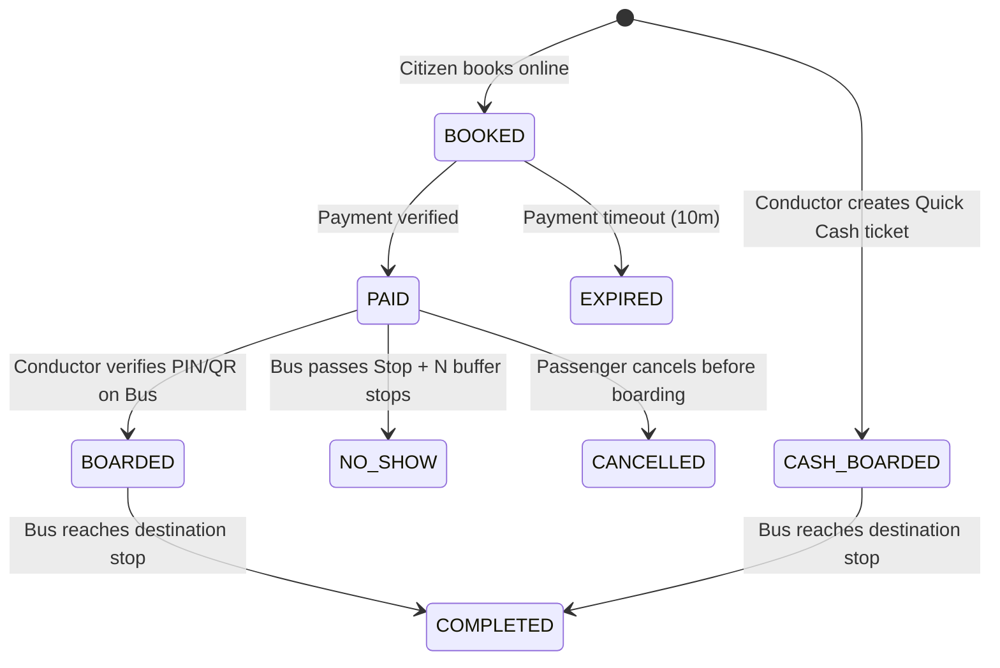

# CitiLink — Final Product & Technical Specification

> **Smart Public Transport, Digital Ticketing, Route-Flexible Travel PIN & Live Occupancy Platform**

CitiLink is a next-generation public transit platform consisting of a **Citizen App** and an **Offline-First Conductor App**, backed by a centralized **FastAPI + PostgreSQL** backend.

The system delivers:
* **Route-Level Flexible Travel PIN**: Short 3-digit (000–999) or 2-digit Senior (00–99) PIN valid across **any bus running on the booked route corridor**.
* **GPS-Based Bus Tracking**: Live "Where Is My Bus?" ETA and distance tracking.
* **Sensorless Live Occupancy**: Accurate occupancy derived from digital verification + quick cash ticketing.
* **Segment-Based Availability**: Real-time crowd level calculations (🟢 Good, 🟡 Moderate, 🔴 Crowded) for specific journey segments.
* **Conductor-First Speed**: Sub-second ticket verification via numeric keypad, QR fallback, and passenger lookup.
* **Offline-First Resilience**: Local manifest caching and queued event synchronization for uninterrupted validation during network drops.
* **Cash Passenger Support**: 2-tap cash ticket issuing for seamless digital + physical crowd accounting.

---

# 1. High-Level Product Architecture

```text
                                CITILINK PLATFORM
                                        │
             ┌──────────────────────────┴──────────────────────────┐
             │                                                     │
       CITIZEN APP                                           CONDUCTOR APP
  (Android / Jetpack Compose)                           (Android / Jetpack Compose)
  • Route & Stop Discovery                              • Route-level PIN Keypad Verification
  • Any-Bus Route Travel PIN                            • Quick Cash Ticket Issuance
  • Live GPS Tracking & ETA                             • Offline Manifest & Sync Engine
  • Segment Availability (🟢🟡🔴)                       • Real-time Onboard Passenger Count
  • Razorpay UPI / Card Booking                         • QR Scanner & Name/Phone Lookup
             │                                                     │
             └──────────────────────────┬──────────────────────────┘
                                        │ (HTTPS / WebSockets)
                                        ▼
                                 FASTAPI BACKEND
             ┌──────────────────────────┼──────────────────────────┐
             ▼                          ▼                          ▼
     PostgreSQL + PostGIS         GPS Ingestion              Realtime Hub
    (Supabase / Cloud SQL)     (Bus GPS / Device)       (WebSockets / PubSub)
             │                          │                          │
             └──────────────────────────┴──────────────────────────┘
                                        │
                                        ▼
                                 ADMIN DASHBOARD
                         (React / TypeScript / Tailwind)
                         • Fleet & Schedule Management
                         • Live Bus Radar & Corridor Congestion
                         • Revenue & Occupancy Analytics
```

---

# 2. Core Architectural Separation

CitiLink decouples public transit telemetry into three distinct concerns:

1. **GPS Telemetry**: Answers *"Where is the bus physically on its route?"*
2. **Route-Level Ticketing & Travel PIN**: Answers *"Who has paid to travel along this corridor?"*
3. **Conductor Verification & Cash Entry**: Answers *"Who is physically onboard right now?"*

```text
GPS Location + Route Corridor PIN + Conductor Boarding Events = Real-Time Transport Intelligence
```

No expensive automated passenger counting (APC) cameras or turnstile sensors are required.

---

# 3. Route Corridor Multi-Bus PIN Model (Nashik Pattern)

### The Real-World Corridor Challenge
In high-frequency transit corridors (e.g., CBS ➔ Panchavati, Route 12 in Nashik), multiple buses (Bus 101, Bus 102, Bus 103) operate in succession. A passenger purchasing a ticket from Stop A to Stop B should not be locked into a single physical vehicle; they should be able to board **whichever bus on that route arrives first**.

### How Route-Corridor PIN Allocation Works
1. **Corridor PIN Pool**: When a citizen books a journey on **Route R** from **Stop A** to **Stop B**:
   - The system allocates a short PIN (`142` for standard passengers, `42` for senior citizens).
   - This PIN is reserved across the **entire active Route R corridor pool** during the ticket's active validity window (e.g., 90–120 minutes from booking).
2. **Universal Route Validation**:
   - Rahul Sharma books on Route 12. His PIN is `142`.
   - Bus 101, Bus 102, and Bus 103 are all active on Route 12.
   - The trip manifest for all active buses on Route 12 contains ticket `142`.
3. **Atomic Boarding & Bus Binding**:
   - When Rahul boards **Bus 102** and says *"One-Four-Two"*, Conductor on Bus 102 enters `142`.
   - Bus 102 registers the `BOARD` event, binding Rahul's ticket specifically to `trip_run_id` of Bus 102.
   - The backend (and synced route manifests) immediately marks PIN `142` as **BOARDED on Bus 102**, preventing any double-boarding on Bus 101 or Bus 103.
4. **PIN Pool Capacity**:
   - Standard 3-digit pool: `100` to `999` (900 unique codes).
   - Senior 2-digit pool: `10` to `99` (90 unique codes).
   - Because average bus capacities are 40–65 passengers, 900 simultaneous active unboarded corridor tickets comfortably support 10–15 concurrent buses running on the same route corridor without PIN collision.

---

# 4. End-to-End Citizen Journey

```text
Open CitiLink App
      ↓
Search Origin & Destination (e.g. CBS ➔ Panchavati)
      ↓
View Next Arriving Buses on Route 12 (Bus 101 @ 3 min, Bus 102 @ 7 min)
      ↓
View Live Segment Availability (🟢 24 seats free on Bus 101)
      ↓
Book Ticket & Pay via UPI / Razorpay (Single or Group)
      ↓
Receive Route Travel PIN (e.g. 142) + Backup QR
      ↓
Board Any Arriving Bus on Route 12 (e.g. Bus 102)
      ↓
Speak PIN "142" to Conductor
      ↓
Conductor taps [BOARD] (Ticket binds to Bus 102, Occupancy updates)
      ↓
Live Journey Progress & Destination Alert
      ↓
Alight at Panchavati ➔ Ticket Completed
```

---

# 5. Live Occupancy & Segment Intelligence

### Segment Calculation Formula
A transit route is an ordered sequence of stops: $S_1 \rightarrow S_2 \rightarrow S_3 \rightarrow \dots \rightarrow S_n$.
The occupancy on any segment $(S_k \rightarrow S_{k+1})$ is calculated dynamically:

$$\text{Occupancy}(S_k \rightarrow S_{k+1}) = \sum \text{Digital Active Passengers} + \sum \text{Cash Active Passengers}$$

Where an active passenger is onboard if:
$$\text{Boarding Stop Index} \le k < \text{Destination Stop Index}$$

### Bus Capacity Configuration
Each vehicle in the fleet defines its individual capacity limits:
* `seated_capacity`: e.g. 40
* `standing_capacity`: e.g. 20
* `total_capacity`: 60

### Availability Tiers for Citizens
* 🟢 **Good Availability**: Occupancy $\le 60\%$ of total capacity
* 🟡 **Limited Availability / Standing Only**: $60\% < \text{Occupancy} \le 90\%$
* 🔴 **Very Crowded / Full**: Occupancy $> 90\%$

### Capacity Lock on Booking
When a user attempts to book for a group of size $G$ on a corridor from $S_A$ to $S_B$:
The system ensures that for all segments $S_k \in [S_A, S_B)$:
$$\text{Current Occupancy}(S_k) + G \le \text{Total Capacity}$$

---

# 6. Conductor App & Verification Engine

The Conductor App is designed for high-stress, crowded transit environments requiring single-second operations.

### Verification Options
1. **Travel PIN (Primary, ~2 seconds)**:
   - High-contrast 3x4 numeric keypad.
   - Audio feedback on input and validation.
   - Screen displays: Passenger Name, Group Count, Route, Origin/Destination, Payment Status.
   - One tap on `[BOARD]` increments occupancy.
2. **QR Code Scanning (Secondary fallback)**:
   - Built-in ML Kit / ZXing camera scanner for noisy environments.
3. **Passenger Lookup (Emergency fallback)**:
   - Search by mobile number, passenger name, or ticket ID in case of dead battery or forgotten PIN.

### Quick Cash Boarding (2 Taps)
For unreserved/cash passengers boarding at the stop:
* Conductor selects: `Destination Stop` + `Passenger Count` (default: 1).
* Conductor taps `[CASH BOARD ₹20]`.
* System records an anonymous `CASH` ticket, increments occupancy by count, and queues local event.

---

# 7. Offline-First Synchronization & Event Queue

Conductor devices frequently encounter cellular dead zones.

```text
               OFFLINE FLOW                     ONLINE SYNC
         ┌───────────────────────┐       ┌────────────────────────┐
         │ Conductor inputs PIN  │       │ Internet Reconnected   │
         └──────────┬────────────┘       └───────────┬────────────┘
                    │                                │
                    ▼                                ▼
         ┌───────────────────────┐       ┌────────────────────────┐
         │ Check Local SQLite /  │       │ Flush Pending Queue to │
         │ Room DB Route Manifest│       │ POST /api/v1/sync      │
         └──────────┬────────────┘       └───────────┬────────────┘
                    │                                │
                    ▼                                ▼
         ┌───────────────────────┐       ┌────────────────────────┐
         │ Record Event in Local │       │ Server Processes State │
         │ Event Queue (JSONL)   │       │ Idempotently           │
         └───────────────────────┘       └────────────────────────┘
```

### Manifest Schema on Device
* `trip_manifest`: Active tickets on the route corridor with hashed lookup index by PIN.
* `local_events`: Append-only table storing `event_id`, `trip_run_id`, `ticket_id`, `event_type` (`BOARD`, `CASH_BOARD`, `NO_SHOW`), `timestamp`, `sync_status` (`PENDING`, `SYNCED`).

---

# 8. Complete Ticket State Machine



---

# 9. Critical Business Rules (System Invariants)

1. **Route-Corridor PIN Uniqueness**: A Travel PIN must identify at most one active, unboarded ticket within the same Route Corridor pool.
2. **Atomic Bus Binding**: The moment a PIN is boarded on Bus $X$, it is immediately bound to Bus $X$ and invalidated for any subsequent boarding attempts on other buses.
3. **Passenger Count vs Ticket Count**: All capacity and occupancy calculations MUST aggregate $\sum \text{passenger\_count}$, not count of ticket rows.
4. **Leading Zero Preservation**: PINs are strictly formatted strings (`07` is never converted to integer `7`).
5. **GPS vs Occupancy Decoupling**: GPS determines bus geofence/stop arrival. Conductor boarding events determine onboard passenger headcount.
6. **Configurable No-Show Threshold**: An unboarded paid ticket transitions to `NO_SHOW` when all active buses on that corridor pass the passenger's origin stop by $N$ configurable stops (default: 2 stops).
7. **Zero Data Loss Offline Mode**: All boarding actions performed offline are guaranteed to sync idempotently via UUID `event_id` deduplication.

---

# 10. Technology Stack Summary

| Layer | Technology | Rationale |
| :--- | :--- | :--- |
| **Citizen App** | Android (Kotlin, Jetpack Compose) | Native performance, reactive UI, MapLibre SDK |
| **Conductor App** | Android (Kotlin, Jetpack Compose, Room SQLite) | Ultra-fast offline-first DB, camera scanner, keypad UI |
| **Backend API** | Python (FastAPI, Pydantic v2, SQLAlchemy 2.0 async) | High-throughput async I/O, robust type validation |
| **Database** | PostgreSQL 16 + PostGIS | Spatial route queries, atomic transactions, row-level locking |
| **Realtime PubSub**| Redis Streams / Supabase Realtime / WebSockets | Low-latency GPS broadcast and occupancy updates |
| **Payments** | Razorpay Gateway (UPI Intent, Cards) | Instant Indian payment processing |
| **Admin Dashboard**| React (Vite, TypeScript, Tailwind CSS, Lucide icons) | Responsive fleet telemetry & analytics |
